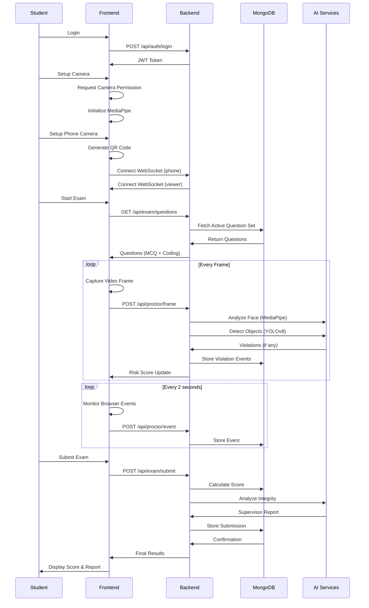
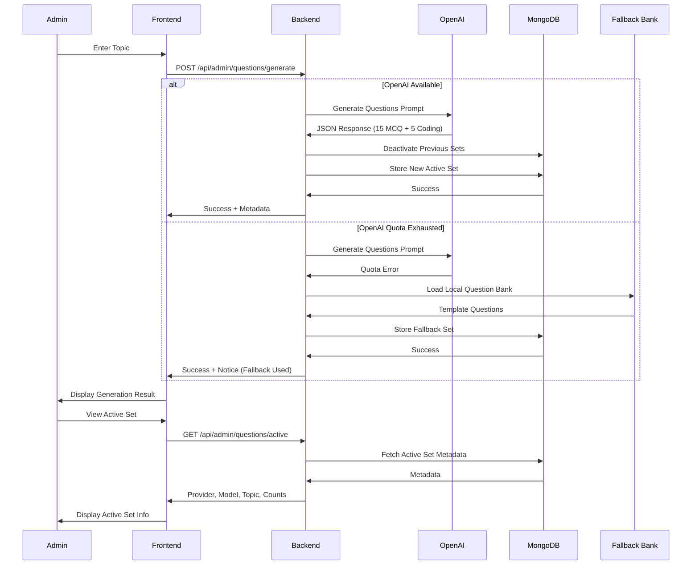
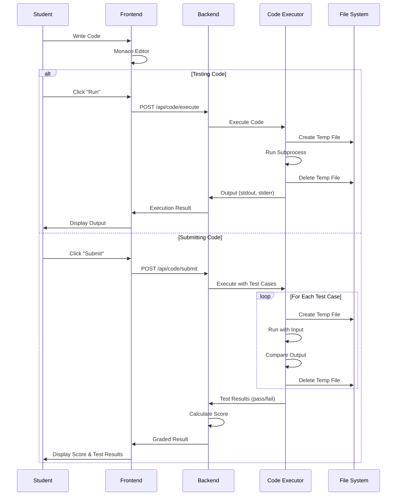

# MindMesh v2 - Use Case Diagram

## Visual Representation of System Use Cases

This document provides a visual representation of all use cases in the MindMesh v2 system using Mermaid diagrams and ASCII art.

---

## Primary Use Case Diagram

```mermaid
graph TB
    subgraph "MindMesh v2 System"
        %% Student Use Cases
        UC1[Login/Register]
        UC2[Setup Exam Environment]
        UC3[Take Examination]
        UC4[Solve Coding Problems]
        UC5[View Results]
        UC6[Be Monitored]

        %% Admin Use Cases
        UC7[Generate AI Questions]
        UC8[View Active Question Set]
        UC9[View All Submissions]
        UC10[Review Detailed Report]
        UC11[View Statistics]

        %% AI Supervisor Use Cases
        UC12[Analyze Exam Integrity]
        UC13[Calculate Risk Score]

        %% System Use Cases
        UC14[Manage Question Sets]
        UC15[Store Submissions]
        UC16[Store Violation Events]
        UC17[Execute Code Sandbox]
        UC18[Relay Camera Stream]
    end

    %% Actors
    Student((Student))
    Admin((Admin))
    AISupervisor((AI Supervisor))
    Phone((Phone Camera))
    System((System))

    %% Student Relationships
    Student --> UC1
    Student --> UC2
    Student --> UC3
    Student --> UC4
    Student --> UC5
    Student --> UC6

    %% Admin Relationships
    Admin --> UC7
    Admin --> UC8
    Admin --> UC9
    Admin --> UC10
    Admin --> UC11

    %% AI Supervisor Relationships
    AISupervisor --> UC12
    AISupervisor --> UC13

    %% System Relationships
    System --> UC14
    System --> UC15
    System --> UC16
    System --> UC17
    System --> UC18

    %% Phone Relationship
    Phone --> UC18

    %% Dependencies
    UC3 -.includes.-> UC4
    UC3 -.includes.-> UC6
    UC6 -.triggers.-> UC12
    UC6 -.triggers.-> UC13
    UC3 -.uses.-> UC14
    UC3 -.stores.-> UC15
    UC6 -.stores.-> UC16
    UC4 -.uses.-> UC17
    UC2 -.uses.-> UC18

    style Student fill:#4CAF50
    style Admin fill:#2196F3
    style AISupervisor fill:#FF9800
    style Phone fill:#9C27B0
    style System fill:#607D8B
```



---

## Detailed Actor-Use Case Relationships

### Student Actor

```
┌────────────────────────────────────────────────────────────┐
│                         STUDENT                             │
└────────────────────────────────────────────────────────────┘
                           │
                           │
        ┌──────────────────┼──────────────────┐
        │                  │                  │
        ▼                  ▼                  ▼
   ┌─────────┐       ┌──────────┐      ┌──────────┐
   │ Login/  │       │  Setup   │      │   Take   │
   │Register │       │   Exam   │      │   Exam   │
   └─────────┘       │Environment│     └──────────┘
        │            └──────────┘           │
        │                  │                │
        │                  ├────────────────┤
        │                  │                │
        ▼                  ▼                ▼
   ┌─────────┐       ┌──────────┐      ┌──────────┐
   │  View   │       │  Solve   │      │    Be    │
   │ Results │       │  Coding  │      │Monitored │
   └─────────┘       └──────────┘      └──────────┘
```

### Admin Actor

```
┌────────────────────────────────────────────────────────────┐
│                      ADMINISTRATOR                          │
└────────────────────────────────────────────────────────────┘
                           │
                           │
        ┌──────────────────┼──────────────────┐
        │                  │                  │
        ▼                  ▼                  ▼
   ┌─────────┐       ┌──────────┐      ┌──────────┐
   │Generate │       │   View   │      │   View   │
   │   AI    │       │  Active  │      │   All    │
   │Questions│       │Question  │      │Submissions│
   └─────────┘       │   Set    │      └──────────┘
                     └──────────┘           │
                                            │
                         ┌──────────────────┼──────────────────┐
                         │                  │                  │
                         ▼                  ▼                  ▼
                    ┌──────────┐      ┌──────────┐      ┌──────────┐
                    │  Review  │      │   View   │      │  Analyze │
                    │ Detailed │      │Statistics│      │  Trends  │
                    │  Report  │      └──────────┘      └──────────┘
                    └──────────┘
```

### AI Supervisor Actor

```
┌────────────────────────────────────────────────────────────┐
│                      AI SUPERVISOR                          │
└────────────────────────────────────────────────────────────┘
                           │
                           │
        ┌──────────────────┴──────────────────┐
        │                                     │
        ▼                                     ▼
   ┌─────────┐                          ┌──────────┐
   │ Analyze │                          │Calculate │
   │  Exam   │                          │   Risk   │
   │Integrity│                          │  Score   │
   └─────────┘                          └──────────┘
        │                                     │
        │                                     │
        └──────────────┬──────────────────────┘
                       │
                       ▼
                  ┌──────────┐
                  │ Generate │
                  │  Report  │
                  │   with   │
                  │Reasoning │
                  └──────────┘
```

---

## Use Case Flow Diagrams

### Flow 1: Student Taking an Exam



### Flow 2: Admin Generating Questions



### Flow 3: Code Execution



---

## Proctoring System Architecture

```
┌─────────────────────────────────────────────────────────────────┐
│                     STUDENT BROWSER                             │
│                                                                  │
│  ┌──────────────┐  ┌──────────────┐  ┌──────────────┐         │
│  │   Primary    │  │   Browser    │  │  Secondary   │         │
│  │   Camera     │  │   Events     │  │   Camera     │         │
│  │  (Laptop)    │  │  Monitoring  │  │   (Phone)    │         │
│  └──────┬───────┘  └──────┬───────┘  └──────┬───────┘         │
│         │                 │                  │                  │
└─────────┼─────────────────┼──────────────────┼──────────────────┘
          │                 │                  │
          │                 │                  │
          ▼                 ▼                  ▼
┌─────────────────────────────────────────────────────────────────┐
│                      BACKEND SERVICES                            │
│                                                                  │
│  ┌──────────────────────────────────────────────────────────┐  │
│  │               Proctoring Service                          │  │
│  ├──────────────────────────────────────────────────────────┤  │
│  │                                                           │  │
│  │  ┌────────────┐  ┌────────────┐  ┌────────────┐         │  │
│  │  │   Face     │  │  Object    │  │  Browser   │         │  │
│  │  │  Analyzer  │  │  Detector  │  │   Event    │         │  │
│  │  │ (MediaPipe)│  │  (YOLOv8)  │  │  Handler   │         │  │
│  │  └─────┬──────┘  └─────┬──────┘  └─────┬──────┘         │  │
│  │        │               │               │                 │  │
│  │        └───────────────┼───────────────┘                 │  │
│  │                        │                                 │  │
│  │                        ▼                                 │  │
│  │              ┌──────────────────┐                        │  │
│  │              │  Risk Scoring    │                        │  │
│  │              │     Engine       │                        │  │
│  │              └────────┬─────────┘                        │  │
│  │                       │                                  │  │
│  └───────────────────────┼──────────────────────────────────┘  │
│                          │                                     │
│                          ▼                                     │
│  ┌──────────────────────────────────────────────────────────┐  │
│  │           AI Supervisor (Groq/Gemini)                     │  │
│  │  - Analyzes violation patterns                            │  │
│  │  - Generates reasoning                                    │  │
│  │  - Recommends action                                      │  │
│  └────────────────────────┬─────────────────────────────────┘  │
│                           │                                    │
└───────────────────────────┼────────────────────────────────────┘
                            │
                            ▼
                    ┌───────────────┐
                    │    MongoDB    │
                    │               │
                    │ - Submissions │
                    │ - Violations  │
                    │ - Screenshots │
                    └───────────────┘
```

---

## System Component Interaction Map

```
                    ┌─────────────────────┐
                    │   Frontend (React)  │
                    └──────────┬──────────┘
                               │
                ┌──────────────┼──────────────┐
                │              │              │
                ▼              ▼              ▼
        ┌──────────┐   ┌──────────┐   ┌──────────┐
        │   Auth   │   │   Exam   │   │  Admin   │
        │  Routes  │   │  Routes  │   │  Routes  │
        └────┬─────┘   └────┬─────┘   └────┬─────┘
             │              │              │
             └──────────────┼──────────────┘
                            │
                ┌───────────┴───────────┐
                │   FastAPI Backend     │
                └───────────┬───────────┘
                            │
        ┌───────────────────┼───────────────────┐
        │                   │                   │
        ▼                   ▼                   ▼
┌───────────────┐   ┌───────────────┐   ┌───────────────┐
│   MongoDB     │   │  AI Services  │   │Code Executor  │
│               │   │               │   │               │
│- Question Sets│   │- MediaPipe    │   │- Python       │
│- Submissions  │   │- YOLOv8       │   │- C/Java       │
│- Violations   │   │- OpenAI       │   │- SQL          │
│               │   │- Groq/Gemini  │   │               │
└───────────────┘   └───────────────┘   └───────────────┘
```

---

## Use Case Implementation Status

### Legend:
- ✅ Fully Implemented
- ⚠️ Partially Implemented
- ❌ Not Implemented
- 🔜 Planned for Future

| Use Case | Status | Implementation Level |
|----------|--------|---------------------|
| **UC-1**: Login/Register | ✅ | JWT auth, demo users |
| **UC-2**: Setup Exam Environment | ✅ | Camera + QR setup |
| **UC-3**: Take Examination | ✅ | MCQ + Coding mix |
| **UC-4**: Solve Coding Problems | ✅ | 4 languages supported |
| **UC-5**: View Results | ✅ | Comprehensive display |
| **UC-6**: Be Monitored | ✅ | Real-time AI proctoring |
| **UC-7**: Generate AI Questions | ✅ | OpenAI + fallback |
| **UC-8**: View Active Question Set | ✅ | Metadata display |
| **UC-9**: View All Submissions | ✅ | Sortable table |
| **UC-10**: Review Detailed Report | ✅ | Expandable details |
| **UC-11**: View Statistics | ✅ | Basic metrics |
| **UC-12**: Analyze Exam Integrity | ✅ | Agentic analysis |
| **UC-13**: Calculate Risk Score | ✅ | Real-time scoring |
| **UC-14**: Manage Question Sets | ✅ | CRUD operations |
| **UC-15**: Store Submissions | ✅ | MongoDB storage |
| **UC-16**: Store Violation Events | ✅ | Event logging |
| **UC-17**: Execute Code Sandbox | ✅ | Multi-language |
| **UC-18**: Relay Camera Stream | ✅ | WebSocket relay |
| **UC-19**: Student Profile Mgmt | 🔜 | Future feature |
| **UC-20**: Instructor Role | 🔜 | Future feature |
| **UC-21**: Live Proctor Dashboard | 🔜 | Future feature |
| **UC-22**: Plagiarism Detection | 🔜 | Future feature |
| **UC-23**: Session Recording | ❌ | Not planned |
| **UC-24**: Advanced Analytics | ⚠️ | Basic only |
| **UC-25**: Multi-Tenant Support | ❌ | Not planned |
| **UC-26**: Exam Scheduling | ❌ | Not planned |
| **UC-27**: Export/Reporting | ⚠️ | Basic only |
| **UC-28**: Mobile Application | 🔜 | Future feature |

---

## Key Metrics

### Implementation Coverage:
- **Core Use Cases Implemented**: 18/18 (100%)
- **Advanced Features**: 6/10 (60%)
- **Security Features**: 8/12 (67%)
- **AI/ML Components**: 4/4 (100%)

### System Capabilities:
- **User Roles**: 2 active (Student, Admin)
- **Question Types**: 2 (MCQ, Coding)
- **Programming Languages**: 4 (Python, C, Java, SQL)
- **AI Providers**: 3 (OpenAI, Groq, Gemini)
- **Proctoring Methods**: 5 (Face, Object, Browser, Dual-camera, AI)

### Performance Metrics:
- **Analysis Frequency**: Every 2 seconds
- **Code Execution Timeout**: 10 seconds
- **Exam Duration**: 10 minutes
- **Token Expiry**: 480 minutes
- **AI Cooldown**: 20 seconds

---

## Conclusion

MindMesh v2 implements a comprehensive set of use cases covering:
- Student examination experience
- Administrative management
- AI-powered supervision
- Real-time proctoring
- Code execution and assessment

The system architecture is designed for scalability, modularity, and extensibility, with clear separation of concerns and well-defined interfaces between components.

---

**Document Version**: 1.0
**Last Updated**: March 26, 2026
**Project**: MindMesh v2
